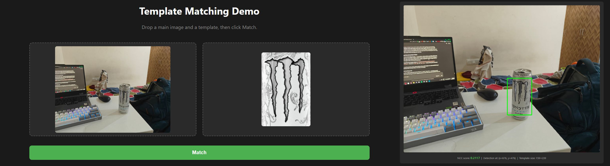

# Classical Template Matching from Scratch

A from-scratch implementation of object detection via template matching using **Normalized Cross-Correlation (NCC)** and an **image pyramid** for coarse-to-fine search. Includes a Flask web app for drag-and-drop usage.

No machine learning. No neural networks. Just classical computer vision math, implemented from first principles in Python and NumPy.

## What it does

Given a main image and a small template, the system finds *where in the main image the template appears* and draws a bounding box around it.



*Detection on a real photograph using a Monster claw logo template downloaded from the internet. The detector correctly localized the logo despite differences in lighting, contrast, and source between template and image.*

## Approach

The detector slides the template across every valid position in the main image, computes the **Normalized Cross-Correlation** between each patch and the template, and reports the position with the highest score.

Three core ideas:

1. **NCC similarity measure** — compares two image patches in a way that is invariant to uniform brightness and contrast changes. Mean-subtraction removes lighting offsets; magnitude normalization removes contrast differences. Output is bounded in [−1, +1] where +1 is a perfect structural match.

2. **Sliding window search** — applies NCC at every valid template position in the main image. Produces a 2D *response map* that visualizes match strength across the entire image.

3. **Image pyramid for speed** — naive sliding-window NCC is slow (O(H·W·h·w)). The pyramid trick performs a fast coarse search at a downsampled resolution, then refines the peak position at successively higher resolutions, dramatically reducing total work.

## Results

### Verification against OpenCV

Compared the from-scratch implementation against `cv2.matchTemplate` (TM_CCOEFF_NORMED) on the same input.

| Implementation | Time | Peak Location | Score |
|---|---|---|---|
| From-scratch (Python loops) | 172.4 s | (716, 421) | 1.0000 |
| OpenCV (optimized C++) | 0.052 s | (716, 421) | 1.0000 |

Identical result; OpenCV is ~3,316× faster due to compiled-language optimization. This confirms the from-scratch implementation is mathematically equivalent to the production reference.

### Pyramid speedup

| Method | Time | Peak Location | Score |
|---|---|---|---|
| Brute force | 172.4 s | (716, 421) | 1.0000 |
| Pyramid coarse-to-fine | 2.48 s | (716, 421) | 1.0000 |

**~70× speedup** in pure Python from algorithmic improvement alone (no hardware tricks).

### Stress testing

Tested the detector under controlled distortions to map out NCC's strengths and limitations.

| Distortion | Score | Detection Status |
|---|---|---|
| Clean baseline | 1.0000 | Correct |
| Gaussian noise σ=30 | 0.7690 | Correct |
| Gaussian noise σ=100 | 0.3278 | Correct |
| Gaussian noise σ=150 | 0.2220 | Correct |
| Gaussian noise σ=520 | 0.0455 | **Broken** |
| Brightness shifts (±120) | ~1.0000 | Invariant ✓ |
| Contrast 0.3× to 1.5× | ~1.0000 | Invariant ✓ |
| Contrast 2.5× (with clipping) | 0.9048 | Mild damage |
| Image scale 0.7× | 0.3163 | Approximately correct |
| Image scale 1.5× | 0.3575 | **Confidently wrong** |
| Image scale 0.4× | 0.2783 | **Wrong object** |

**Findings:**
- NCC is **mathematically invariant** to uniform brightness and contrast changes.
- NCC is **robust** to even severe Gaussian noise — detection remains correct long after the score becomes "low confidence."
- NCC is **not invariant** to scale. When object size in the image differs from the template, NCC may select unrelated regions of the image with similar gross structure.

These limitations point naturally toward scale-invariant feature methods (SIFT, SURF) and learned methods (CNNs).

## Project Structure
template-matching-project/
├── 01_load_image.ipynb         # Exploration notebook with all experiments
├── template_matcher.py         # Reusable detector module
├── app.py                      # Flask web server
├── templates/
│   └── index.html              # Drag-and-drop frontend
└── main.png                    # Test image
## How to run

### Prerequisites
pip install numpy opencv-python matplotlib flask flask-cors
(Or use Anaconda — it ships with most of these.)

### Run the web app
python app.py
Open `http://localhost:5000` in your browser. Drag-and-drop a main image and a template, click Match.

### Use the detector programmatically

```python
import cv2
from template_matcher import pyramid_match

main = cv2.imread("main.png", cv2.IMREAD_GRAYSCALE)
template = cv2.imread("template.png", cv2.IMREAD_GRAYSCALE)

y, x, score = pyramid_match(main, template, num_levels=3)
print(f"Found at ({x}, {y}) with score {score:.4f}")
```

## Limitations

- **No scale invariance.** A template at a different scale than its appearance in the main image will fail or land on the wrong object.
- **No rotation invariance.** Rotated objects are not found.
- **No occlusion handling.** Partial obstructions of the target object significantly degrade the match.
- **Score interpretation depends on template source.** Scores are bounded in [−1, +1] but absolute values are systematically lower when the template comes from a different image than the search target.

## Future work

- Implement **multi-scale template search** by re-running detection at multiple template sizes.
- Compare against feature-based detectors (SIFT, ORB) on the same test image.
- Add a confidence threshold to the web app to flag low-confidence detections.

## Built with

- Python 3.12, NumPy, OpenCV (matchTemplate used only for verification, not for core matching)
- Flask for the web interface
- Matplotlib for visualization

---

Built as a learning project to understand classical object detection from first principles.